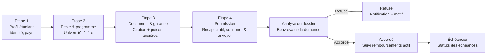
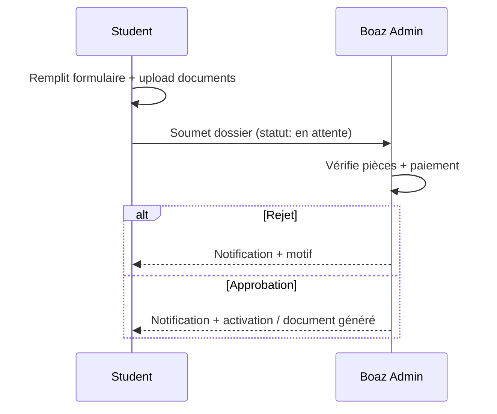

# Boaz Study Portal — App Flows (Spec)

These diagrams capture the **intended product flows** described for the student + admin portal (student-facing flows + back-office review).

---

## 1) Authentication & entry point

```mermaid
flowchart LR
  A[App opened] --> B[Login / Registration]
  B --> C{Authenticated?}
  C -- No --> B
  C -- Yes --> D[Accueil (Home)\nService marketplace]
  D --> E[Sidebar visible\nNavigation always available]
```

---

## 2) Souscription (subscription) flow — multi-step wizard

```mermaid
flowchart LR
  S1[Étape 1\nChoisir un service] --> S2[Étape 2\nFormulaire\nInfos personnelles + détails du service]
  S2 --> S3[Étape 3\nDocuments\nUpload + preview (PDF inline)]
  S3 --> S4[Étape 4\nPaiement\nWallet ou versement]
  S4 --> R[Résultat\nSoumis → En attente]

  subgraph PD[Payment path detail]
    direction LR
    P1[Boaz Wallet\nPayer depuis le solde] --> V[Verification admin\nDossier examiné]
    P2[Preuve de versement\nUpload reçu bancaire] --> V
    V -->|Rejeté| X[Rejeté\nNotification envoyée]
    V -->|Approuvé| Y[Approuvé\nDocument généré]
  end

  S4 -. Choix paiement .-> P1
  S4 -. Choix paiement .-> P2
```

---

## 3) Demande de financement — distinct 4-step wizard



---

## 4) Boaz Wallet — top-up + transaction history

```mermaid
flowchart LR
  W1[Wallet (solde prépayé)] --> W2[Recharger le wallet]
  W2 --> W3[Virement bancaire externe]
  W3 --> W4[Upload reçu / preuve]
  W4 --> W5[En attente\nValidation admin]
  W5 -->|Validé| W6[Solde crédité]
  W5 -->|Rejeté| W7[Rejeté\nNotification + motif]

  W6 --> P[Utiliser le solde\npour payer une souscription]
  W1 --> H[Mes historiques\nJournal des transactions]
  W6 --> H
  W7 --> H
```

---

## 5) Admin Dashboard — back-office review (Boaz staff only)

```mermaid
flowchart LR
  S[Student user] -->|Clicks "Tableau de bord"| N[404 / Not authorized]

  A[Admin user] --> L[Admin login]
  L --> D[Tableau de bord]

  D --> S1[Dossiers souscriptions\nExaminer / valider / rejeter]
  D --> S2[Wallet top-ups\nValider les recharges]
  D --> S3[Financements\nApprouver / rejeter]
  D --> S4[Génération documents\nAttestations, certificats, etc.]

  S1 --> U[Mettre à jour statuts\n+ notifier l'étudiant]
  S2 --> U
  S3 --> U
  S4 --> U
```

---

## 6) Sidebar — permanent navigation (student space)

```mermaid
flowchart TD
  A[Authenticated area] --> S[Sidebar (always visible)]

  S --> H[Accueil\nMarketplace services]
  S --> MS[Mes souscriptions]
  MS --> MS1[Services]
  MS --> MS2[Financement]
  MS --> MS3[Remboursements]

  S --> PV[Preuves de versement\nListe des reçus uploadés]
  S --> W[Mon Wallet Boaz\nSolde + historiques]
  S --> AFF[Programme d'affiliation\nRéférer d'autres étudiants]
  S --> INV[Mes factures\nHistorique factures]
  S --> SET[Paramètres\nCompte & préférences]
```

---

## Cross-cutting: two-actor model (student ↔ admin)



